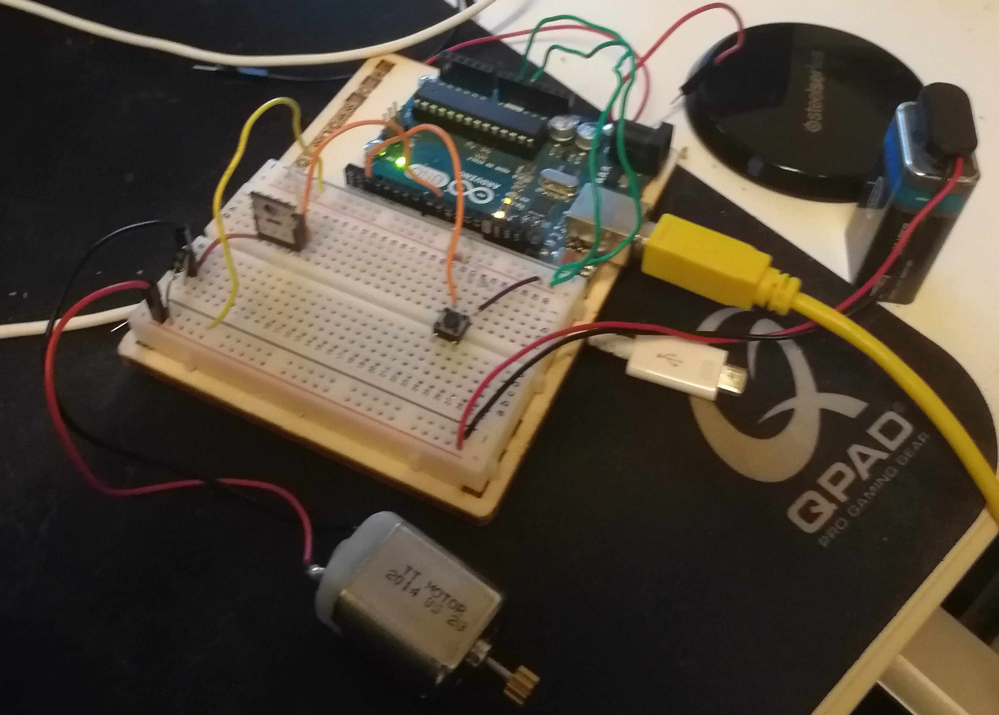
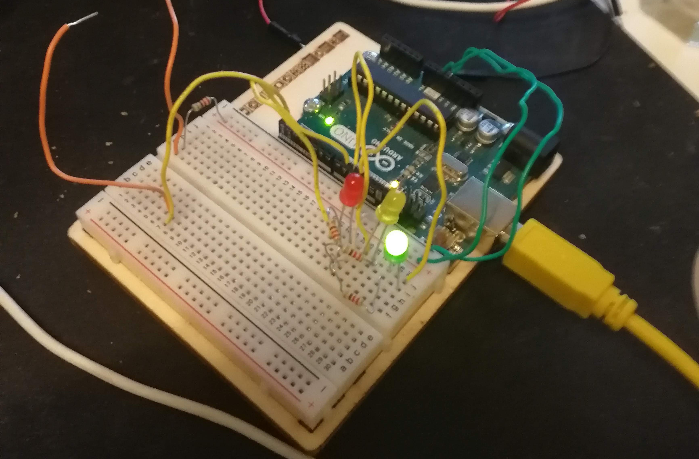
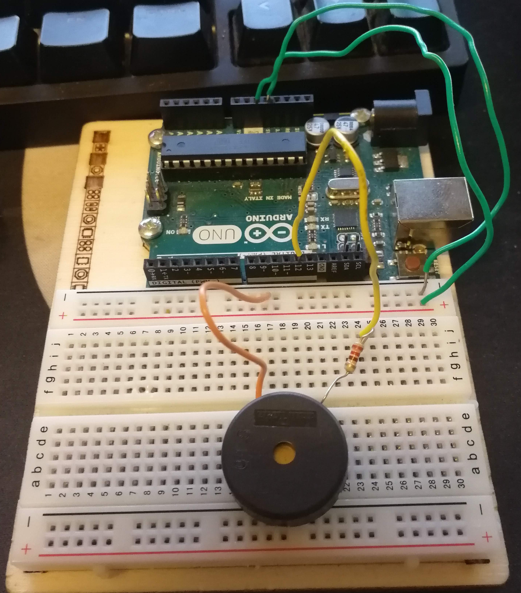

#Lab 6

# Opg 1
En transistor er et halvledene matriale som er nyttig i elektriske kretser for varierende grunner. Noen av disse er:

* Forsterkning av signaler
* Funksjonalitet som en bryter
* Diverse annet

Moderne cpuer fungerer primært via flere milliarder transistorer.

#Opg 2

Kode: https://raw.githubusercontent.com/vetlelode/arduino_tat/master/Lab6/prev/Opg2.cpp
***Bilde havner nederst på pdf***

#Opg 3

Kode: https://raw.githubusercontent.com/vetlelode/arduino_tat/master/Lab6/prev/Opg3.cpp
***Bilde havner nederst på pdf***

#Opg 4
 
Kode: https://raw.githubusercontent.com/vetlelode/arduino_tat/master/Lab6/prev/Opg4.cpp